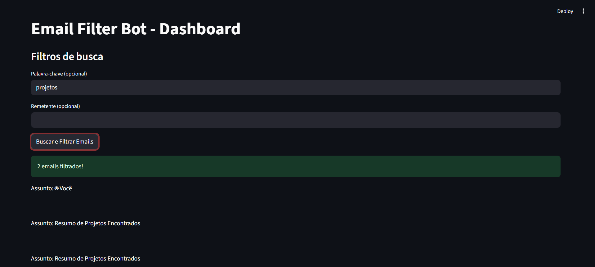
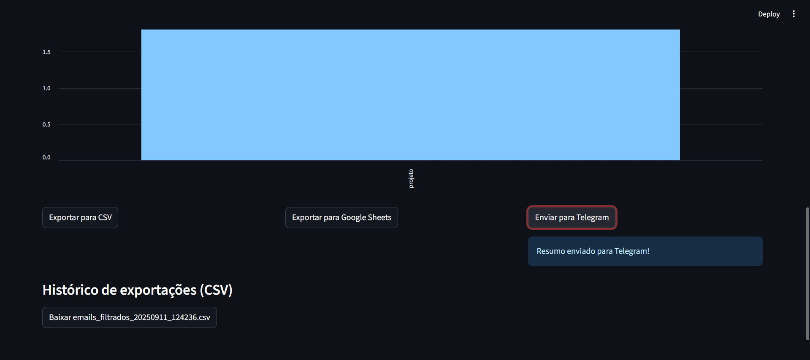
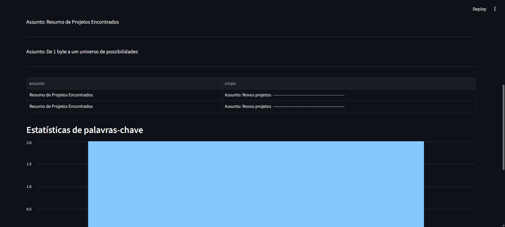

# �️ Prints da Interface

### Dashboard


### Funcionalidades


### Métricas

# �📧 email-filter-bot

Um bot automatizado desenvolvido em Python para **ler, filtrar e exportar e-mails** com base em palavras-chave, integrando com **CSV**, **Google Sheets** e **Telegram**.

## 🚀 Funcionalidades

* 📥 Leitura de e-mails via IMAP (Gmail)
* 🔎 Filtragem com base em palavras-chave específicas
* 📨 Envio de resumo dos e-mails encontrados para seu próprio e-mail
* 📊 Exportação para arquivos CSV e Google Sheets
* 📲 Envio de resumo diretamente para o Telegram

## 📂 Estrutura dos Arquivos

```
email-filter-bot/
├── .env                         # Variáveis de ambiente sensíveis
├── bot_telegram.py              # Envia resumos para o Telegram
├── config.py                    # Configurações do projeto (dotenv)
├── email_reader.py             # Leitura e filtragem de e-mails
├── email_sender.py             # Envia resumo por e-mail
├── email-filtro-bot.json       # Credenciais do Google Sheets
├── exportador.py               # Exporta e-mails para CSV
├── exportador_sheets.py        # Exporta e-mails para Google Sheets
├── main.py                     # Arquivo principal do projeto
├── README.md                   # Documentação do projeto
```


## 🖥️ Interface Visual

O projeto conta com uma interface web interativa feita com **Streamlit**:

* Visualize, filtre e exporte emails facilmente
* Veja gráficos de estatísticas por palavra-chave
* Baixe arquivos CSV exportados direto pela interface

Para rodar a interface:

```bash
streamlit run app.py
```

## 🛠 Como Funciona

1. **Leitura de e-mails:** o bot acessa sua caixa de entrada do Gmail via IMAP.
2. **Filtragem:** ele procura e-mails com palavras relacionadas a:

   * **Nível:** iniciante, júnior, estágio...
   * **Tecnologia:** python, sql, dados, excel...
   * **Contexto:** freela, projeto, vaga, remoto...
3. **Exporta os dados:** para um CSV local e uma planilha no Google Sheets.
4. **Envio:** o resumo é enviado para seu e-mail e via Telegram.


## ⚙️ Configuração

Crie um arquivo `.env` com as seguintes variáveis:

```env
EMAIL_USUARIO=seu-email@gmail.com
SENHA_APP=sua-senha-de-app
GOOGLE_CREDENTIALS=email-filtro-bot.json
```

No `config.py`, o `TELEGRAM_BOT_TOKEN` e `TELEGRAM_CHAT_ID` são definidos diretamente no código.

## 🔑 Autenticação

* **Gmail:** use uma senha de aplicativo para autenticar.
* **Google Sheets:** crie um projeto no Google Cloud, ative a API do Sheets, e gere uma chave do tipo service account (JSON).


## 📦 Dependências

Instale as dependências do projeto com:

```bash
pip install -r requirements.txt
```

Principais pacotes:
- streamlit
- gspread
- google-auth
- python-dotenv
- pytest

## ▶️ Executando

Com tudo configurado, basta rodar o bot com:

```bash
python main.py
```


## 🧪 Testes Automatizados

O projeto possui testes unitários com **pytest**. Para rodar os testes:

```bash
pytest tests/
```

## 📌 Observações

* O projeto está em versão inicial, mas funcional.

* Os dados de autenticação e credenciais **não devem ser expostos publicamente**. Nunca faça commit de arquivos `.env` ou credenciais reais em projetos públicos.
* Prints e vídeos da interface podem ser adicionados para enriquecer o portfólio.

## 📧 Contato

Feito por Guilherme Santos - [guilhermesantosdev01@gmail.com](mailto:guilhermesantosdev01@gmail.com)

---

Esse projeto tem como objetivo estudar automação com Python, integrações com APIs e boas práticas de organização de projetos.

Sinta-se à vontade para clonar, testar e adaptar!
